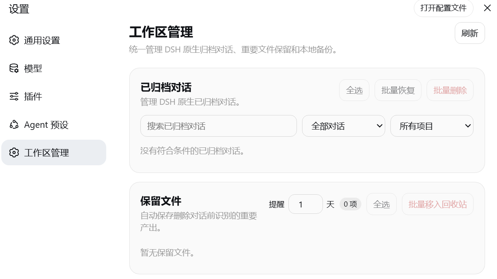
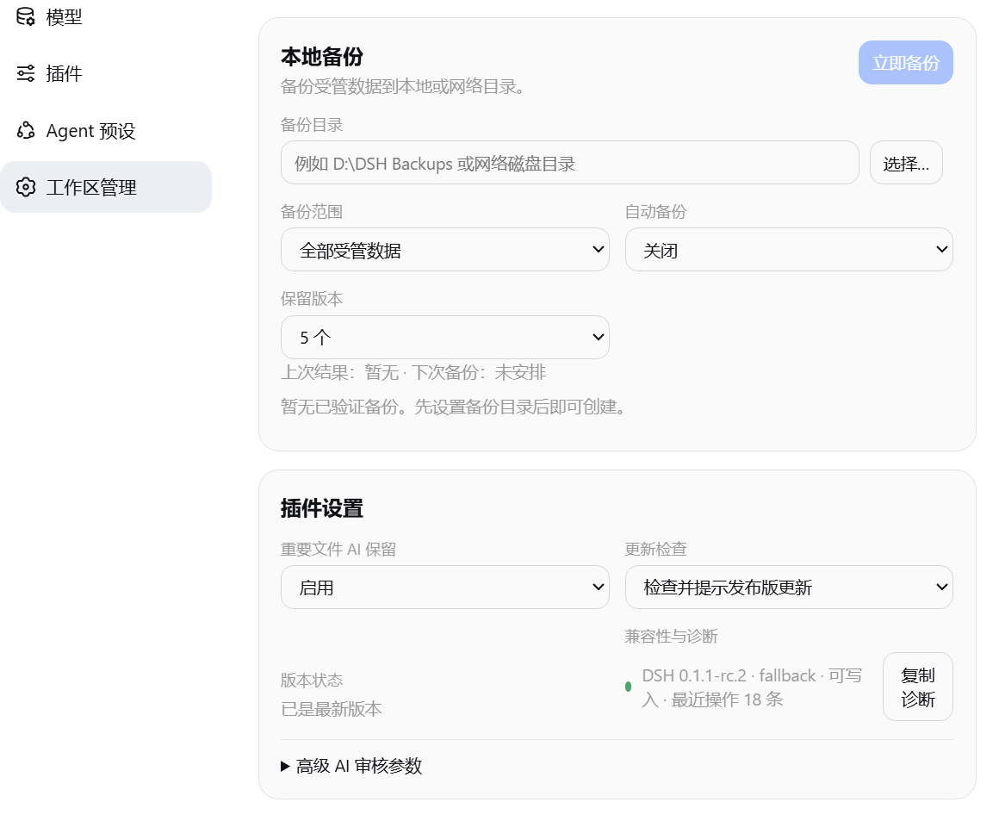

# DSH 工作区管理

[English](README.md) · [简体中文](README.zh-CN.md) · [版本下载](https://github.com/yxv1203-collab/dsh-conversation-archive/releases) · [问题反馈](https://github.com/yxv1203-collab/dsh-conversation-archive/issues)

在 DeepSeek Harness 设置中管理已归档对话、保留重要文件并备份会话数据。

## 功能

| 模块 | 功能说明 |
| --- | --- |
| 归档管理 | 搜索对话，按类型或项目筛选，支持单项与批量取消归档、删除。 |
| 文件保留 | 删除前由 DSH 模型审核候选产出；校验副本后存入共享文件库，支持去重、来源记录、恢复、批量移除与提醒。 |
| 本地备份 | 手动、定时或正常关闭前生成 ZIP；支持本地与网络目录、清单及哈希校验、保留数量设置，以及恢复到空目录。 |
| 工作区支持 | 支持不同 Windows 磁盘和独立项目中的已登记文件夹，自动补登记历史会话，重启后保持共享文件库位置稳定。 |
| 设置与诊断 | 保存使用偏好，提供应用内提醒、兼容版本更新提示与运行诊断，不自动安装更新。 |

## 界面



<details>
<summary>本地备份与插件设置</summary>



</details>

## 安装

需要 Windows 10 或 11、PowerShell 5.1+，以及 Node.js 20+ 或 DSH 要求的更高版本。已测试 DSH `0.1.1-rc.2`，其他 DSH 版本尚未验证。

```powershell
dsh plugin --profile web add github:yxv1203-collab/dsh-conversation-archive#v1.0.0
```

重启 DSH，打开“设置 → 工作区管理”。无需调整现有工作区结构。

<details>
<summary>离线安装与卸载</summary>

从 [版本下载](https://github.com/yxv1203-collab/dsh-conversation-archive/releases/tag/v1.0.0) 获取 `.tgz` 安装包及对应的 `.sha256` 文件，确认校验值一致后安装。

```powershell
Get-FileHash .\dsh-conversation-archive-1.0.0.tgz -Algorithm SHA256
Get-Content .\dsh-conversation-archive-1.0.0.tgz.sha256
dsh plugin --profile web add .\dsh-conversation-archive-1.0.0.tgz
```

卸载命令：

```powershell
dsh plugin --profile web remove dsh-conversation-archive
```

安装或卸载后重启 DSH。已有保留文件和备份不会被删除。如需替换同版本号的早期构建，请卸载后安装当前发布包，并核对校验值。

</details>

## 使用与数据保护

- 归档状态以 DSH 原生记录为准。插件仅管理已归档对话，不另建项目目录体系。
- 删除仅回收所选会话的 DSH 数据，不删除原始项目目录或源码。文件审核和副本校验成功后，才继续保护性删除。在 DSH `0.1.1-rc.2` 中，工作区引用清理会在下次正常启动时完成。
- 文件审核可能将候选内容发送给 DSH 配置的模型服务商。文件保留属于选择性保护，不能替代完整项目备份。
- 备份范围为已登记的会话数据和保留文件，不包含完整源码仓库。自动备份默认关闭，默认保留五份已验证备份；新备份验证通过后才回收超额旧备份。
- 工作区应使用可访问的盘内子目录，不直接使用盘符或共享根目录。恢复不覆盖已有文件。网络备份目标须具备相应权限及回收站支持；插件不直接连接云盘账号。

<details>
<summary>元数据未登记</summary>

该提示表示会话尚无有效的工作区映射。插件会在启动和归档同步时，从 DSH 元数据自动回填。若提示持续出现，请先检查工作区访问权限和会话元数据，再使用产出保护或完整备份功能。

恢复保留文件到原位置时，目标须属于可识别的 DSH 工作区；否则请选择其他恢复目录。

</details>

## 参与贡献

通过 [Issues](https://github.com/yxv1203-collab/dsh-conversation-archive/issues) 提交问题或功能建议，也可联系 [yxv1203@gmail.com](mailto:yxv1203@gmail.com)。请附上 DSH 版本、复现步骤和脱敏诊断信息。提交代码前，在本机安装兼容版本的 DSH 并运行 `npm test`。

## 开源协议

[MIT](LICENSE)
